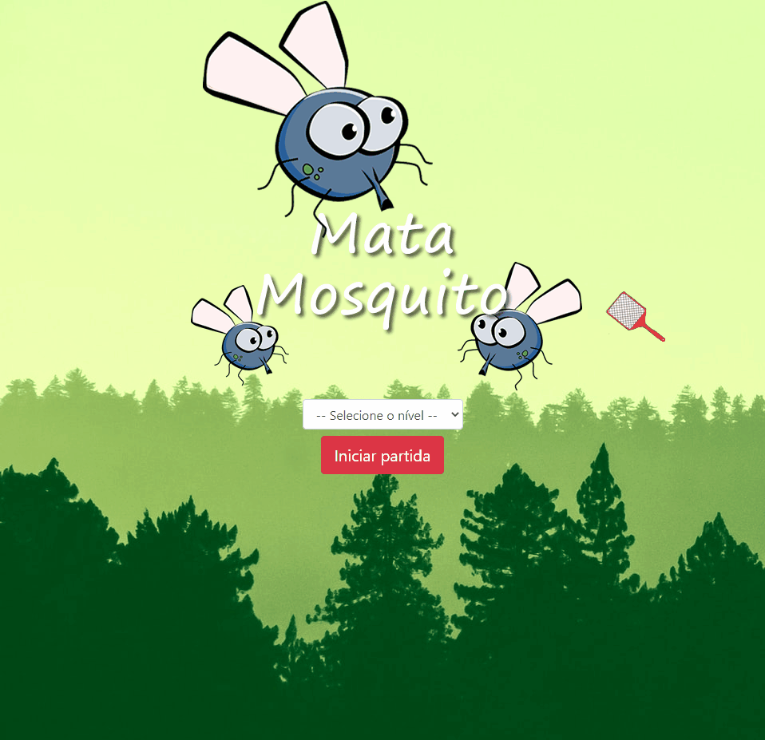

<h1 align="center">
    
</h1>

<h1>
    
</h1>

## Índice
- [Sobre](#-sobre)
- [Conhecimentos aplicados](#-conhecimentos-aplicados)
- [Tecnologias utilizadas](#-tecnologias-utilizadas)
- [Como abrir o projeto](#-como-abrir-o-projeto)
- [Agradecimentos](#-agradecimentos)

---

## 📋 Sobre

O app **mata-mosquito** é um jogo criado dentro do curso [Desenvolvimento Web Completo - 2020](https://www.udemy.com/course/web-completo/), com intuito de colocar em prática os conteúdos estudados na seção **JavaScript**.

---

## 💡 Conhecimentos aplicados
**JavaScript** Intermediário:
- Eventos
- Manipulaçao do DOM
- Manipulação do BOM

---

## 🚀 Tecnologias utilizadas
- Vanilla Javascript (Javascript puro)
- HTML
- CSS
- Bootstrap

---

## 📁 Como abrir o projeto
- Faça o download dos arquivos
- Abra o index.html

---

## 🙏 Agradecimentos

- Aos professores do curso [Desenvolvimento Web Completo - 2020](https://www.udemy.com/course/web-completo/)

- À Daniele Leão Evangelista pelo ótimo vídeo ["como criar um README"](https://www.youtube.com/watch?v=Gcb60rPbnKA&list=LL55cCksWKKyAoCbO5G5iqHQ&index=1)
